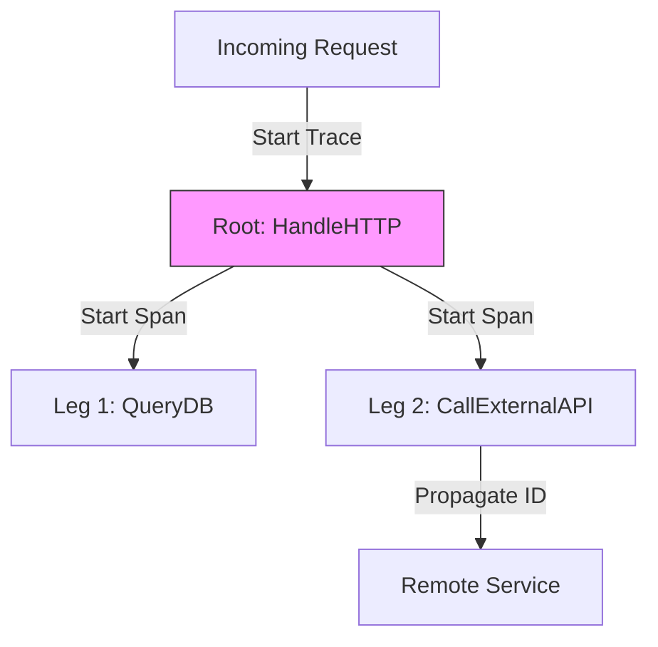

# OPS.3 Distributed Tracing Basics

## Mission

Master request storytelling. Learn how **Trace IDs** and **Span IDs** follow a single request across multiple functions and service boundaries. Understand how to use OpenTelemetry (OTel) concepts to explain latency, identify bottlenecks, and visualize the relationship between your Go code and external dependencies like databases or APIs.

## Prerequisites

- OPS.2 Prometheus Integration
- Section 07: Concurrency (Mastery of `context.Context`)

## Mental Model

Think of Distributed Tracing as **A GPS Tracker for a Delivery**.

1. **The Trip (The Trace)**: The entire journey of a package from the warehouse to the customer's door.
2. **The Leg (The Span)**: A specific part of the journey (e.g., Warehouse -> Truck, Truck -> Sort Center).
3. **The ID (Trace ID)**: A unique number printed on the package that stays the same throughout the entire trip.
4. **The Parent-Child Relationship**: The "Sort Center" span knows it is a child of the "Truck" leg.
5. **The Advantage**: If the package is late, you don't just know "It's late" (Metrics); you know exactly which leg of the journey took too long.

## Visual Model



## Machine View

- **Context Propagation**: In Go, the `context.Context` is the only way to carry trace information across function boundaries.
- **OTel SDK**: The standard library doesn't include tracing. You must use the OpenTelemetry Go SDK to create and export spans.
- **Sampling**: Tracing every single request is computationally expensive and generates massive amounts of data. In production, we often only trace a small percentage (e.g., 1%) of requests.

## Run Instructions

```bash
# Run the demo to see how spans are created and nested
go run ./10-production/05-observability/3-distributed-tracing-basics
```

## Code Walkthrough

### Starting a Span
Shows how to use a `Tracer` to create a new span from a context and defer the `span.End()` call.

### Adding Metadata (Attributes)
Demonstrates attaching useful information like `user_id` or `http.status_code` to a span for better debugging.

### Context Hand-off
Shows the pattern of passing the `ctx` through every function so that child spans can correctly identify their parent.

## Try It

1. Run the code. Observe the log output showing the Trace IDs and Span IDs.
2. Add a `time.Sleep` to one of the functions. Notice how the span duration increases in the output.
3. Discuss: Why should you never use `context.Background()` inside a traced function? (Hint: It breaks the trace chain).

## In Production
**Don't trace everything.** High-volume services can generate terabytes of trace data per day. Use **Probability Sampling** to keep costs down. If a specific request fails or is exceptionally slow, you can use "Tail-based sampling" to ensure that those specific traces are kept, even if the "Happy Path" traces are discarded.

## Thinking Questions
1. What is the difference between a Trace and a Span?
2. How does a remote service know to continue the same trace started by your app?
3. Why is `context` essential for distributed tracing in Go?

## Next Step

Metrics and Tracing help you see what's wrong. Feature flags help you fix it without a redeploy. Continue to [OPS.4 Feature Flags](../4-feature-flags).
