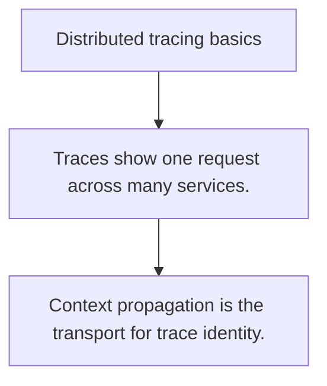

# OPS.3 Distributed tracing basics

## Mission

Learn how trace and span IDs follow a request through multiple boundaries so latency can be explained, not guessed.

## Prerequisites

- OPS.2

## Mental Model

Tracing is request storytelling with timestamps and parent-child relationships.

## Visual Model



## Machine View

Trace context travels alongside the request so each boundary can attach timing and metadata to the same end-to-end path.

## Run Instructions

```bash
go run ./10-production/05-observability/3-distributed-tracing-basics
```

## Code Walkthrough

### Traces show one request across many services.

Traces show one request across many services.

### Spans explain where latency was spent inside that requ

Spans explain where latency was spent inside that request.

### Context propagation is the transport for trace identit

Context propagation is the transport for trace identity.

## Try It

1. Change one of the example inputs and rerun the lesson.
2. Explain which boundary the lesson is trying to make explicit.
3. Describe how you would apply OPS.3 in a small service or tool.

## ⚠️ In Production

Tracing is expensive enough that you should know which paths matter and how sampling changes what you see.

## 🤔 Thinking Questions

1. What problem does this topic solve?
2. What breaks if this boundary is handled implicitly instead of explicitly?
3. Where would you expect to use this topic in production Go code?

## Next Step

Continue to `OPS.4`.
