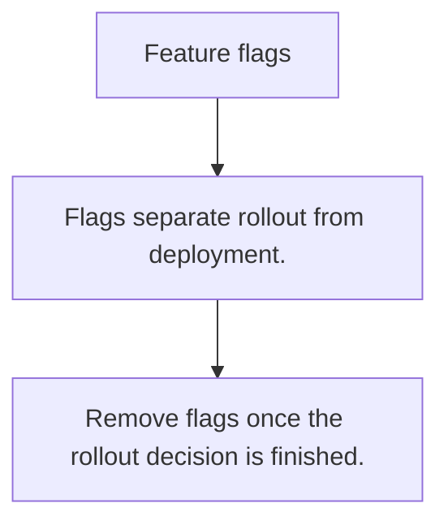

# OPS.4 Feature flags

## Mission

Learn how flag-controlled rollout changes the deployment story by separating shipping from activating behavior.

## Prerequisites

- OPS.3

## Mental Model

A feature flag is a runtime decision point that can turn behavior on or off without rebuilding the binary.

## Visual Model



## Machine View

Flags move some release control from deploy time to runtime decision time, which can lower risk but increase system complexity.

## Run Instructions

```bash
go run ./10-production/05-observability/4-feature-flags
```

## Code Walkthrough

### Flags separate rollout from deployment.

Flags separate rollout from deployment.

### Targeting rules should be simple and inspectable.

Targeting rules should be simple and inspectable.

### Remove flags once the rollout decision is finished.

Remove flags once the rollout decision is finished.

## Try It

1. Change one of the example inputs and rerun the lesson.
2. Explain which boundary the lesson is trying to make explicit.
3. Describe how you would apply OPS.4 in a small service or tool.

## ⚠️ In Production

Flags should have owners, expiry expectations, and observability. Permanent forgotten flags become dead architecture.

## 🤔 Thinking Questions

1. What problem does this topic solve?
2. What breaks if this boundary is handled implicitly instead of explicitly?
3. Where would you expect to use this topic in production Go code?

## Next Step

Continue to `OPS.5`.
