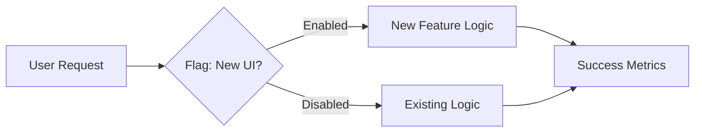

# OPS.4 Feature Flags

## Mission

Master the "Runtime Toggle." Learn how to decouple **Deployment** (moving code to production) from **Release** (exposing a feature to users). Understand how to use feature flags to perform "Canary Releases," "A/B Testing," and emergency kill-switches. Learn the discipline of cleaning up flags to prevent long-term technical debt.

## Prerequisites

- OPS.1 Metrics Basics (To measure the impact of the flag)

## Mental Model

Think of Feature Flags as **A Light Switch in a Dark Room**.

1. **Deployment**: You walk into the room and install the light fixture (The code is in production).
2. **Release**: You flip the switch (The feature is active for users).
3. **The Advantage**: If the light fixture starts smoking (The feature is broken), you just flip the switch back off. You don't have to call an electrician to uninstall the fixture (Perform a full roll-back of the binary).
4. **The Discipline**: Once you know the light is safe, you should remove the switch and hardwire it (Remove the flag from the code).

## Visual Model



## Machine View

- **Runtime Decision**: Unlike a config file (CFG.2) which is usually loaded once on boot, feature flags are often checked on **every request**.
- **The Flag Client**: In production, you rarely use a hardcoded boolean. You use a "Flag Provider" (like LaunchDarkly, Flagsmith, or a custom Redis-backed service) that can update values in real-time.
- **Contextual Targeting**: Flags can be enabled for specific users (e.g., `user_id % 100 < 5` for a 5% rollout) or specific environments.

## Run Instructions

```bash
# Run the demo to see how flags toggle behavior at runtime
go run ./10-production/05-observability/4-feature-flags
```

## Code Walkthrough

### The Flag Interface
Shows how to define a clean abstraction for checking flags so your business logic doesn't depend on a specific provider.

### The Conditional Logic
Demonstrates the `if flag.Enabled("new_feature")` pattern in a real HTTP handler.

### The Lifecycle Management
Discusses why flags should be short-lived and how to track their usage with metrics (OPS.1).

## Try It

1. Run the code. Toggle the "experimental_feature" flag in the configuration.
2. Implement a "Canary" flag that is only enabled for users with an email ending in `@example.com`.
3. Discuss: Why is a feature flag safer than a code roll-back for fixing a bug in production?

## In Production
**Don't let flags rot.** Feature flags are a form of **Technical Debt**. If you leave a flag in the code for 6 months after the feature is released, you now have to maintain two code paths forever. This makes testing harder and the code harder to read. Set an "Expiration Date" for every flag and make the developer who created it responsible for removing it.

## Thinking Questions
1. What is the difference between a "Release Flag" and an "Ops Flag"?
2. How do feature flags interact with your testing strategy?
3. What happens if the feature flag service goes down? (Hint: Think about "Default Values").

## Next Step

Next: `OPS.5` -> `10-production/05-observability/5-alerting-mindset`

Open `10-production/05-observability/5-alerting-mindset/README.md` to continue.
