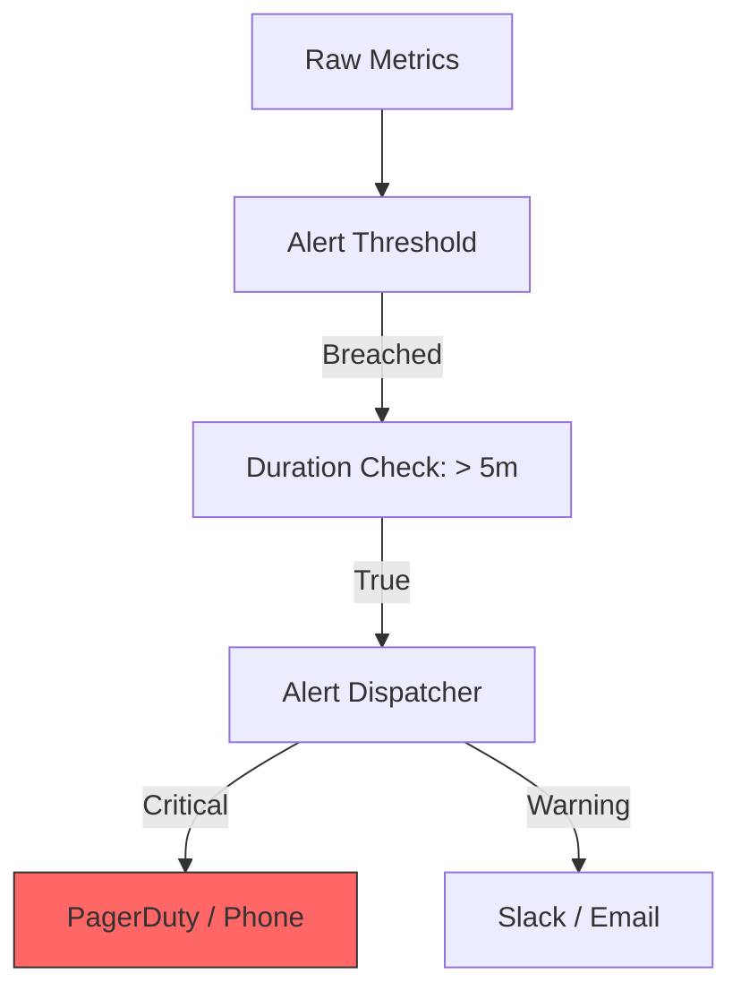

# OPS.5 Alerting Mindset

## Mission

Master the "Signal vs. Noise" challenge. Learn how to transform metrics (OPS.1) and traces (OPS.3) into meaningful **Alerts**. Understand the difference between "Symptom-based" and "Cause-based" alerting, and learn how to use **Service Level Objectives (SLOs)** to decide when an engineer needs to wake up in the middle of the night.

## Prerequisites

- OPS.1 Metrics Basics
- OPS.2 Prometheus Integration

## Mental Model

Think of Alerting as **The Smoke Detector in your House**.

1. **The Sensor (Metric)**: Measures the smoke levels in the room.
2. **The Alarm (Alert)**: If the smoke level stays high for 1 minute, the alarm sounds.
3. **The False Positive**: The alarm sounds because you burnt some toast. You eventually learn to ignore the alarm.
4. **The Critical Failure**: The alarm sounds, but the batteries are dead (The monitoring system is down).
5. **The Goal**: An alarm should only sound if the house is actually on fire (The users are experiencing errors). If the house is just a little dusty (High CPU but low latency), it shouldn't wake you up.

## Visual Model



## Machine View

- **Symptom-based Alerting**: Alerting on what the user sees (e.g., "5xx Error rate > 1%"). This is the gold standard for high-reliability teams.
- **Cause-based Alerting**: Alerting on internal details (e.g., "CPU > 80%"). This often leads to "Alert Fatigue" because high CPU might not actually be affecting the user.
- **Runbooks**: Every alert **must** be linked to a document that tells the on-call engineer exactly what to do when the alert fires.

## Run Instructions

```bash
# Run the demo to see how "Noisy" vs "Useful" alerts are triggered
go run ./10-production/05-observability/5-alerting-mindset
```

## Code Walkthrough

### Defining SLOs
Shows how to translate a business requirement (e.g., "99.9% of requests must succeed") into a technical metric query.

### The Alerting Middleware
Demonstrates a middleware that tracks the "Burn Rate" of your error budget and triggers a notification if it's too high.

### Runbook Integration
Shows how to include a URL to a runbook in the metadata of your prometheus alerts.

## Try It

1. Run the code. Trigger a series of errors. Notice which ones trigger a "Warning" and which ones trigger a "Critical" alert.
2. Change the threshold so that the alert is more sensitive.
3. Discuss: Why is "Alert Fatigue" one of the most dangerous things for a production team?

## In Production
**If it doesn't require an action, it isn't an alert.** If an engineer receives a page, clicks "Acknowledge," and does nothing because "It always does that," then that alert should be deleted or turned into a dashboard. Every page should represent a real fire that requires a human to put it out.

## Thinking Questions
1. What is an SLO (Service Level Objective), and how does it differ from an SLA (Service Level Agreement)?
2. Why should you alert on symptoms (Errors) rather than causes (Memory usage)?
3. How do you prevent "Alert Storms" when one service failure causes 100 other services to alert?

## Next Step

Congratulations! You've completed the Observability track. Now learn how to package your application so it can be deployed to the cloud. Continue to [Track DOCKER: Containerization](../../03-docker-and-deployment).
