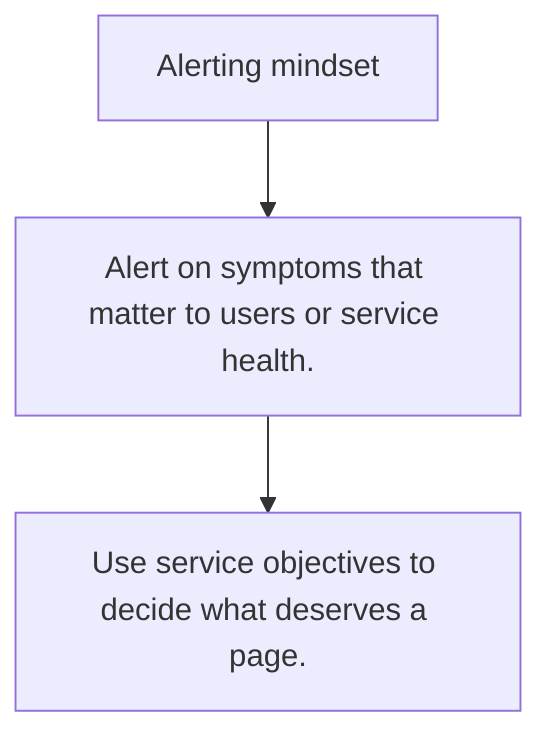

# OPS.5 Alerting mindset

## Mission

Learn how useful alerts differ from noisy alerts and why runbooks and service objectives matter.

## Prerequisites

- OPS.4

## Mental Model

Alerts are requests for human attention, which means they are expensive by default.

## Visual Model



## Machine View

Good alerts connect symptoms to user impact or clear service health risks, not just to every internal fluctuation.

## Run Instructions

```bash
go run ./10-production/05-observability/5-alerting-mindset
```

## Code Walkthrough

### Alert on symptoms that matter to users or service heal

Alert on symptoms that matter to users or service health.

### Tie alerts to runbooks or clear first actions.

Tie alerts to runbooks or clear first actions.

### Use service objectives to decide what deserves a page.

Use service objectives to decide what deserves a page.

## Try It

1. Change one of the example inputs and rerun the lesson.
2. Explain which boundary the lesson is trying to make explicit.
3. Describe how you would apply OPS.5 in a small service or tool.

## ⚠️ In Production

A noisy alert stream teaches engineers to ignore signals, which is the opposite of observability.

## 🤔 Thinking Questions

1. What problem does this topic solve?
2. What breaks if this boundary is handled implicitly instead of explicitly?
3. Where would you expect to use this topic in production Go code?

## Next Step

Use this lesson as a reference surface before moving to the next track in the section.
