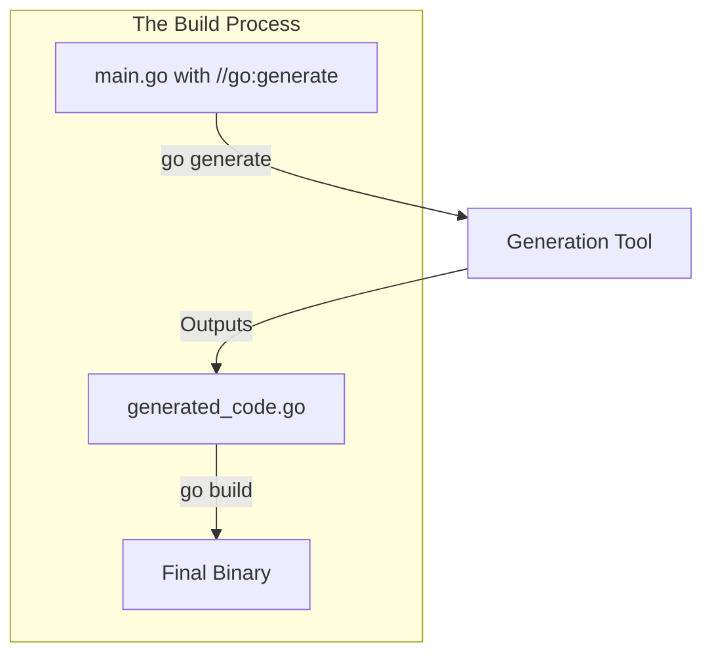

# CG.1 go generate Primer

## Mission

Master the "Build-Time Trigger." Learn how to use the built-in `go generate` command to orchestrate code generation tools. Understand why we prefer "Generation at Build Time" over "Magic at Runtime," and learn the syntax for the `//go:generate` directive that ties your source code to its supporting tools.

## Prerequisites

- Section 05: Packages and I/O (Basic understanding of the Go toolchain)

## Mental Model

Think of `go generate` as **A Batch Script for your Source Code**.

1. **The Comment**: You leave a sticky note (`//go:generate`) on a file saying "When you see this, run this specific tool."
2. **The Command**: You run `go generate ./...`.
3. **The Execution**: Go scans all your files, finds the sticky notes, and runs the commands for you.
4. **The Advantage**: You don't have to remember 10 different shell commands for 10 different tools. You just run the one command Go already knows.

## Visual Model



## Machine View

- **`//go:generate`**: This must be a line comment starting at the beginning of the line, with no space between `//` and `go:generate`.
- **Environment Variables**: When `go generate` runs a command, it provides useful environment variables like `$GOFILE` (the name of the file containing the directive) and `$GOPACKAGE`.
- **Tool Installation**: `go generate` doesn't install tools for you. You should use `go install` or a `tools.go` file to manage your generation dependencies.

## Run Instructions

```bash
# Scan the current package and run all generate directives
go generate ./...

# Run the walkthrough to see generation in action
go run ./10-production/06-code-generation/1-go-generate
```

## Code Walkthrough

### The Directive Syntax
Shows the correct way to write a `//go:generate` comment.

### Using Stringer
Demonstrates the `stringer` tool, which automatically generates a `String()` method for your enums (LB.3).

### The `tools.go` Pattern
Shows the idiomatic way to track your tool dependencies in your `go.mod` file so your teammates have the same version of the generator.

## Try It

1. Run `go generate ./...` in this directory. Notice the new file that appears.
2. Change the name of one of the constants in `main.go` and run `go generate` again.
3. Add a new `//go:generate` directive that runs `echo "Generating code for $GOFILE"`.
4. Discuss: Why should you commit generated code to Git? (Hint: Think about your CI pipeline).

## In Production
**Don't hide the magic.** Always include a comment at the top of generated files (e.g., `// Code generated by ...; DO NOT EDIT.`). This warns other developers not to make manual changes that will be overwritten the next time the generator runs. Also, keep your generation logic **Deterministic**-the same input should always produce the same output, regardless of which machine is running the command.

## Thinking Questions
1. Why is `go generate` better than a manual `Makefile` for Go projects?
2. What happens if a developer forgets to run `go generate` before pushing their code?
3. Should you ever edit a generated file manually?

## Next Step

Next: `CG.2` -> `10-production/06-code-generation/2-mockery`

Open `10-production/06-code-generation/2-mockery/README.md` to continue.
