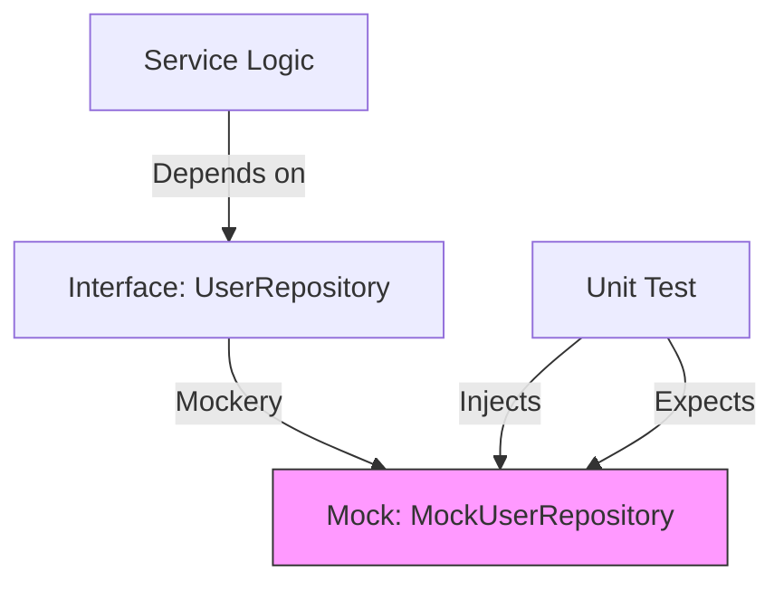

# CG.2 Mockery Workflow

## Mission

Master the "Automated Test Double." Learn how to use **Mockery** to automatically generate mocks for your Go interfaces. Understand why generated mocks are superior to hand-written ones in large projects, and learn the "Expectation" pattern for writing clear, robust unit tests that isolate your business logic from its dependencies.

## Prerequisites

- CG.1 go generate Primer
- Section 08: Quality & Testing (Mocking and Interface-based testing)

## Mental Model

Think of Mockery as **A Stunt Double Factory**.

1. **The Hero (The Production Code)**: Your business logic.
2. **The Dangerous Scene (The Dependency)**: A real database call, an external API, or a file system operation.
3. **The Stunt Double (The Mock)**: An object that looks exactly like the real dependency (It implements the same interface) but is safe to use in a test.
4. **The Factory (Mockery)**: You give it the interface, and it automatically builds the stunt double for you.
5. **The Script (The Test)**: You tell the stunt double exactly what to do ("When the Hero asks for the user, return this fake user object").

## Visual Model



## Machine View

- **`mockery` command**: A standalone tool that parses Go code and generates struct-based mocks using the `testify/mock` package.
- **`On().Return()`**: The Mockery DSL (Domain Specific Language) for defining behaviors.
- **`AssertExpectations()`**: The final check that ensures your code actually called the mock in the way you said it would.

## Run Instructions

```bash
# Generate mocks for all interfaces in the current directory
# mockery --all

# Run the lesson walkthrough
go run ./10-production/06-code-generation/2-mockery
```

## Code Walkthrough

### Defining the Interface
Shows a clean, testable interface for a data-access layer.

### The Generate Directive
Demonstrates placing `//go:generate mockery --name=...` directly above the interface definition.

### The Test Implementation
Shows how to use the generated mock in a real unit test, including setting up return values and verifying calls.

## Try It

1. Add a new method `DeleteUser(id string) error` to the interface in `main.go`.
2. Run `go generate` (or the mockery command). Observe the updated mock file.
3. Write a test case that verifies the `Service` correctly handles a `DeleteUser` error from the repository.
4. Discuss: Why is it better to use `mockery` than to write `struct MyMock { ... }` by hand?

## In Production
**Don't over-mock.** Mocks are powerful, but they can make your tests "Brittle"-meaning they break whenever you refactor the internal implementation of your code, even if the final output is still correct. Use mocks for **External Boundaries** (APIs, Databases) but prefer real objects or simple "Fake" implementations for internal logic whenever possible.

## Thinking Questions
1. What happens if the interface changes but you forget to re-run Mockery?
2. How does Mockery help you test "Error Paths" that are difficult to trigger with a real database?
3. What is the difference between a "Mock," a "Spy," and a "Fake"?

## Next Step

Mocks solve the testing problem. Now let's solve the data-access problem. Continue to [CG.3 sqlc Workflow](../3-sqlc).
