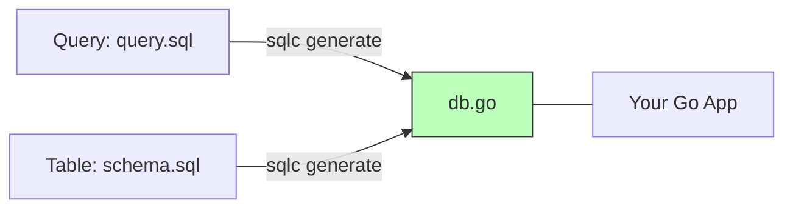

# CG.3 sqlc Workflow

## Mission

Master the "Schema-First" data layer. Learn how to use **sqlc** to generate type-safe Go code directly from raw SQL queries and schemas. Understand why generating your data-access layer is faster and safer than using reflection-heavy ORMs or manual string concatenation, and learn how to maintain a clean "Compile-Time" contract between your Go code and your PostgreSQL database.

## Prerequisites

- CG.1 go generate Primer
- Section 06: Backend & Databases (Basic SQL and Repository pattern)

## Mental Model

Think of sqlc as **A Translator between SQL and Go**.

1. **The Source (SQL)**: You write real, valid SQL (e.g., `SELECT * FROM users WHERE id = ?`).
2. **The Reference (Schema)**: You provide the table definitions so the tool knows that the `id` column is a `UUID` and `email` is a `VARCHAR`.
3. **The Translation (sqlc)**: The tool reads your SQL, compares it to the schema, and generates a Go function that accepts a `uuid.UUID` and returns a `User` struct.
4. **The Advantage**: If you make a typo in your SQL, or try to query a column that doesn't exist, the "Translation" fails at **Build Time**. You don't have to wait until you run the code to find the bug.

## Visual Model



## Machine View

- **`sqlc.yaml`**: The configuration file that tells the tool where to find your SQL files and where to put the generated Go code.
- **`Queries` struct**: The generated object that holds all your database methods, usually wrapping a `*sql.DB` or `*pgx.Pool`.
- **Zero Reflection**: Unlike GORM, sqlc generates standard code that uses the standard library (`database/sql`) directly. It is as fast as hand-written code.

## Run Instructions

```bash
# Generate Go code from SQL files
# sqlc generate

# Run the walkthrough to see sqlc in action
go run ./10-production/06-code-generation/3-sqlc
```

## Code Walkthrough

### The Schema Definition
Shows how to organize your `.sql` files in a `schema/` directory for versioning.

### The Query Annotation
Demonstrates the special comments (`-- name: GetUser :one`) that sqlc uses to name your Go functions.

### The Generated Output
Explores the `internal/db` package and shows how to use the generated `Queries` object in your service logic.

## Try It

1. Examine `schema/schema.sql` and `queries/query.sql`.
2. Add a new query to `query.sql`: `-- name: ListUsers :many`.
3. Run `sqlc generate` (if installed) and see the new method appear in the Go code.
4. Discuss: Why does sqlc make it easier to refactor your database schema than using `db.Query("SELECT ...")` strings?

## In Production
**Don't use sqlc for dynamic filtering.** sqlc is optimized for static, well-defined queries. If you need to build a query where 10 different search filters are optional and combined at runtime, you should use a **Query Builder** (like `squirrel` or `bob`) or write a custom function. Trying to force highly dynamic logic into sqlc often leads to unreadable SQL.

## Thinking Questions
1. Why does `sqlc` need the schema files to generate code for the queries?
2. How does using `sqlc` improve the performance of your application compared to an ORM?
3. Where should you put the generated code in your project structure? (Hint: `internal/db`).

## Next Step

Congratulations! You have completed the Production Operations section. You now have the skills to build, package, observe, and automate production-grade Go services. You are ready for the final stage. Continue to [11 Flagship](../../../11-flagship).
