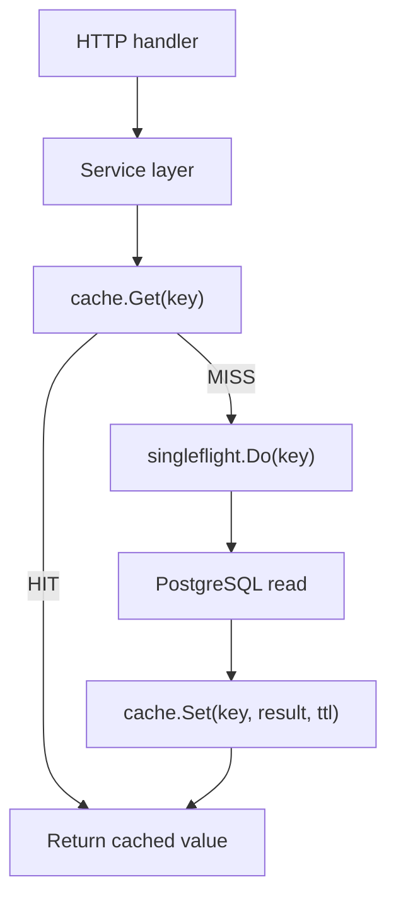
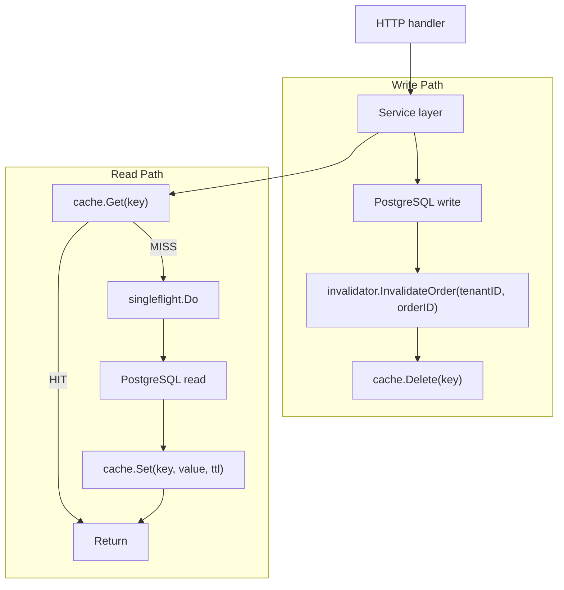

# OPSL.8 Caching Layer

## Mission

Introduce cache-aware behavior without pretending cache invalidation is free.

## What This Module Builds

- cache storage boundary
- cache-aside reads
- TTL behavior
- invalidation rules around changing order and payment state

## You Are Here If

- `OPSL.7` is complete
- there are read paths worth caching
- asynchronous work exists that can make stale data more dangerous

## Proof Surface

This module is implemented in the current tree.

Run:

```bash
go test ./11-flagship/01-opslane/internal/cache/...
go run ./11-flagship/01-opslane/scripts/progress.go
```

The proof surface now covers:

- bounded in-memory cache with TTL and insert-order eviction
- lazy expiry on reads and background janitor sweep
- copy-on-read and copy-on-write for mutation safety
- explicit invalidation via Invalidator after order and payment writes
- prefix-based batch invalidation for tenant-scoped cache groups
- singleflight stampede prevention on hot-key expiry
- HTTP Cache-Control middleware for public and authenticated endpoints
- NoopCache for environments where caching is disabled

Implemented files:

- `internal/cache/cache.go`
- `internal/cache/store.go`
- `internal/middleware/cache.go`

Implementation map: [SURFACE.md](./SURFACE.md)

## Required Files and Boundaries

Caching should be additive, not a hidden source of truth.
PostgreSQL remains the system of record.

## Machine View

The cache sits between the service layer and the repository layer.
Reads check the cache first. On miss, the service reads from PostgreSQL
and populates the cache. On write, the Invalidator deletes affected
cache keys so the next read comes from the database.



The important constraint:

> Invalidation happens AFTER the write succeeds, not before.
> If the DB write fails, the cache still holds the old (correct) value.

## Diagram



## Try It

Change `MaxEntries` in a test from `2` to `3`.
Observe that the third `Set` no longer evicts the first entry.

Then change `DefaultTTL` from `time.Minute` to `1 * time.Millisecond`.
Observe that reads immediately return `ErrNotFound` because entries expire
before the next `Get` call.

## Engineering Questions

- Which reads are safe to cache?
- What should invalidate cached order or payment data?
- How will you prevent stampedes when hot keys expire?

## Next Step

Next: `OPSL.9` -> `11-flagship/01-opslane/modules/09-observability`

Open `11-flagship/01-opslane/modules/09-observability/README.md` to continue.
