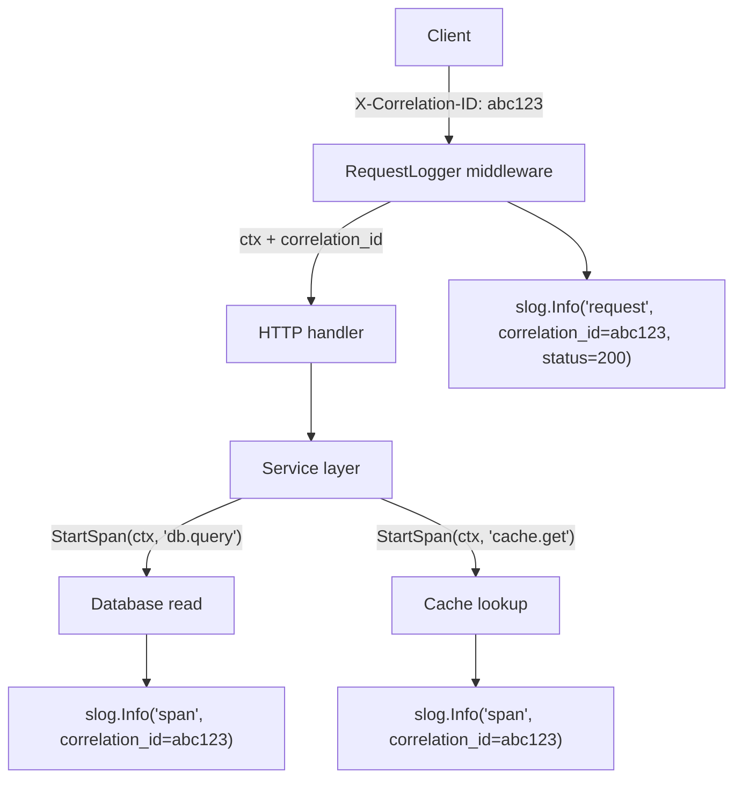
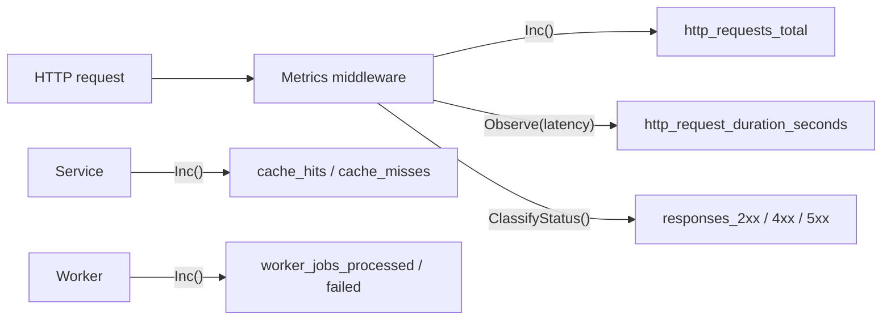

# OPSL.9 Observability

## Mission

Make Opslane explain itself under load, failure, and change.

## What This Module Builds

- structured logging with context-aware enrichment
- correlation IDs that trace a request from HTTP entry through services and workers
- application metrics with atomic counters and latency histograms
- trace-friendly span tracking for named operations

## You Are Here If

- `OPSL.8` is complete
- background work and cache behavior now exist
- debugging the system requires better evidence than raw logs

## Proof Surface

This module is implemented in the current tree.

Run:

```bash
go test ./11-flagship/01-opslane/internal/logging/...
go test ./11-flagship/01-opslane/internal/metrics/...
go test ./11-flagship/01-opslane/internal/tracing/...
go run ./11-flagship/01-opslane/scripts/progress.go
```

The proof surface now covers:

- structured logger factory with JSON and text output formats
- correlation ID generation using crypto/rand (no external deps)
- context propagation of correlation IDs through request lifecycle
- HTTP middleware that generates/extracts correlation IDs, captures status codes, and logs structured request completions
- atomic counters and fixed-bucket histograms (sync/atomic, no external deps)
- pre-registered application metrics: HTTP requests, response status classes, cache hits/misses, worker jobs
- HTTP metrics middleware for request counting and latency distribution
- span tracking with correlation ID linkage for named operations
- cross-service correlation header injection and extraction

Implemented files:

- `internal/logging/context.go`
- `internal/logging/logger.go`
- `internal/logging/middleware.go`
- `internal/metrics/metrics.go`
- `internal/metrics/middleware.go`
- `internal/tracing/tracing.go`

Implementation map: [SURFACE.md](./SURFACE.md)

## Required Files and Boundaries

Instrumentation should help answer why the system is degrading, not just generate more text.

## Machine View

Correlation IDs flow from the HTTP boundary through every layer:



Metrics flow:



## Try It

Add a correlation ID header to a test request and watch it appear in the log output:

```go
req := httptest.NewRequest("GET", "/test", nil)
req.Header.Set("X-Correlation-ID", "my-trace-id")
```

Then change the histogram bucket boundaries and observe how observations distribute differently.

## Engineering Questions

- Which metrics would warn about degradation before users complain?
- What is the minimum log context needed to follow one failed order?
- How should tracing connect HTTP requests to background work?
- When does adding more log fields become counterproductive?

## Next Step

Next: `OPSL.10` -> `11-flagship/01-opslane/modules/10-shutdown-deploy`

Open `11-flagship/01-opslane/modules/10-shutdown-deploy/README.md` to continue.
