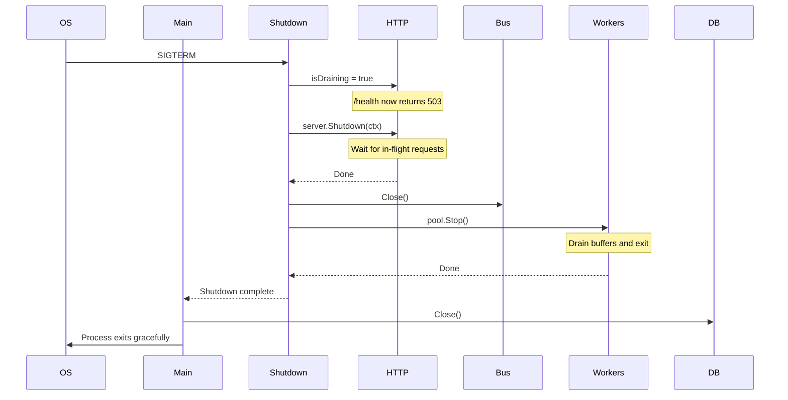

# OPSL.10 Graceful Shutdown and Deployment

## Mission

Finish Opslane as a production-shaped service that can stop, recover, and deploy safely.

## What This Module Builds

- explicit shutdown handling for `SIGINT` and `SIGTERM` signals
- drain behavior for HTTP requests, background workers, and the event bus
- coordinated health check endpoint that returns HTTP 503 during the drain phase
- final integrated proof for the required flagship path

## You Are Here If

- `OPSL.9` is complete
- the service has background work and observability
- the final concern is safe operation under deploy and shutdown pressure

## Proof Surface

This module is fully implemented in the current tree.

```bash
go build ./11-flagship/01-opslane/cmd/server
```

The proof surface includes:

- `cmd/server/shutdown.go`: the Graceful Shutdown coordinator
- `cmd/server/main.go`: integration of the event bus, worker pools, and shutdown logic
- `internal/handlers/handlers.go`: `IsDraining` flag allowing the `/health` endpoint to reflect the draining state

Implementation map: [SURFACE.md](./SURFACE.md)

## Required Files and Boundaries

Shutdown behavior coordinates HTTP, database, and background work. It ensures:
1. Load balancers stop sending traffic (health returns 503).
2. In-flight HTTP requests complete.
3. The event bus stops accepting new jobs.
4. Background workers finish processing existing buffers.
5. The database connection closes safely.

## Machine View

The graceful shutdown sequence:



## Try It

Run the server locally and send a `SIGINT` (Ctrl+C):

```bash
go run ./11-flagship/01-opslane/cmd/server
```

You will see logs demonstrating the drain sequence:

```text
INFO shutdown signal received, initiating graceful drain
INFO HTTP server successfully drained
INFO event bus closed to new publications
INFO worker pool drained and stopped pool=orders
INFO worker pool drained and stopped pool=payments
INFO opslane server gracefully stopped
```

## Engineering Questions

- **Why return 503 on `/health` during drain?** It informs the load balancer (like AWS ALB or Kubernetes) to remove the node from rotation immediately, before the server actually exits, preventing dropped requests.
- **Why close the event bus before stopping workers?** To ensure no late-arriving HTTP requests (finishing during the HTTP drain phase) can publish new jobs while workers are trying to shut down.
- **What happens if a worker takes longer than the deployment orchestrator allows?** The orchestrator (e.g. Kubernetes) will eventually send a `SIGKILL` (usually after 30 seconds). Operations must be idempotent so they can safely resume on another pod.

## Next Step

This path is complete. Return to the section README or continue with the next project milestone.
