# The Go Engineer

[](https://github.com/swe-labs/the-go-engineer/actions)
[](#license)

Master Go backend engineering by moving from machine fundamentals to a production-shaped SaaS backend.

The Go Engineer is a repository-first learning system with:

- 219 registered curriculum items
- 12 locked sections from fundamentals to production systems
- runnable Go lessons and exercises
- tests, race checks, coverage, CI, and curriculum validation
- Opslane, an integrated SaaS backend capstone

If this repository helps you learn or teach Go, star it so more learners can find it.

## What You Will Build

The curriculum ends with [Opslane](./11-flagship/01-opslane), a production-shaped multi-tenant SaaS backend. Opslane brings the curriculum together through configuration, database models, authentication, tenant isolation, HTTP APIs, order processing, payment simulation, event workers, caching, observability, and graceful shutdown.

This is not only a syntax course. The goal is to build the habits behind real Go backend systems: explicit failure handling, clean package boundaries, tests as proof surfaces, operational thinking, and maintainable production code.

## Start Here

Requirements:

- Go version declared in [go.mod](./go.mod)
- CGO-capable C compiler for `go test -race ./...` and SQLite-backed paths

```bash
git clone https://github.com/swe-labs/the-go-engineer.git
cd the-go-engineer
go mod download
go run ./00-how-computers-work/01-what-is-a-program
```

Run the curriculum validator:

```bash
go run ./scripts/validate_curriculum.go
```

Expected stable output:

```text
Success! 601 files with run commands validated, and 12 v2 sections plus 215 v2 items checked.
```

## Who This Is For

This repository is for:

- beginners who want to learn Go deeply instead of memorizing syntax
- backend developers moving to Go from another stack
- self-taught developers who want production engineering habits
- engineers preparing for backend interviews and system implementation work
- teams that want a structured Go learning path with runnable proof surfaces

## Status

Current stable line: `v2.1.x`

Current stable release: `v2.1.1`

Supported branches:

| Branch | Purpose |
| --- | --- |
| `main` | active post-v2.1 implementation and integration line |
| `release/v2` | stable v2.1.x maintenance line |
| `release/v1` | stable v1 maintenance line |

Architecture v2.1 is locked. Normal work may improve lessons, tests, documentation, validators, or the Opslane flagship implementation, but must not add, remove, rename, or reorder public root sections without explicit maintainer approval.

## Curriculum Map

```mermaid
flowchart LR
  s00["s00 Machine Basics"] --> s01["s01 Go Setup"]
  s01 --> s02["s02 Language Basics"]
  s02 --> s03["s03 Functions and Errors"]
  s03 --> s04["s04 Types and Design"]
  s04 --> s05["s05 Packages and I/O"]
  s05 --> s06["s06 Backend and Databases"]
  s06 --> s07["s07 Concurrency"]
  s07 --> s08["s08 Quality and Testing"]
  s08 --> s09["s09 Architecture and Security"]
  s09 --> s10["s10 Production"]
  s10 --> s11["s11 Opslane"]
```



| Phase | Sections | Focus | Progress |
| --- | --- | --- | --- |
| 0 | s00 | machine foundation | 0% to 5% |
| 1 | s01-s04 | language foundation | 5% to 52% |
| 2 | s05-s08 | engineering core | 52% to 87% |
| 3 | s09-s10 | systems engineering | 87% to 96% |
| 4 | s11 | integrated flagship project | 96% to 100% |

## Choose Your Path

Use [LEARNING-PATH.md](./LEARNING-PATH.md) for the full path, bridge path, or targeted section path.

For a paced route through the same material, use the [30-Day Go Engineer Challenge](./docs/challenges/30-day-go-engineer.md).

## Community

Use [docs/community/README.md](./docs/community/README.md) for Q&A format, progress sharing, issue etiquette, and contributor entry points.

New contributors should start with `good first issue`, `help wanted`, documentation, tests, or lesson-polish tasks.

Before opening a large PR, read [CONTRIBUTING.md](./CONTRIBUTING.md).

## Sections

| Section | Folder | Primary outcome |
| --- | --- | --- |
| s00 | [00-how-computers-work](./00-how-computers-work) | understand execution, memory, terminal use, and processes |
| s01 | [01-getting-started](./01-getting-started) | install Go, run programs, and read tool output |
| s02 | [02-language-basics](./02-language-basics) | use values, control flow, slices, maps, and pointers intentionally |
| s03 | [03-functions-errors](./03-functions-errors) | compose functions and handle failure explicitly |
| s04 | [04-types-design](./04-types-design) | model behavior with structs, methods, interfaces, composition, and generics |
| s05 | [05-packages-io](./05-packages-io) | work with modules, packages, CLI input, encoding, and filesystems |
| s06 | [06-backend-db](./06-backend-db) | build HTTP servers, API contracts, gRPC services, and database-backed code |
| s07 | [07-concurrency](./07-concurrency) | coordinate goroutines, channels, context, synchronization, and worker patterns |
| s08 | [08-quality-test](./08-quality-test) | test, benchmark, profile, and verify behavior with evidence |
| s09 | [09-architecture](./09-architecture) | apply package design, architecture patterns, and security controls |
| s10 | [10-production](./10-production) | add logging, shutdown, configuration, observability, deployment, and code generation |
| s11 | [11-flagship](./11-flagship) | integrate the curriculum through the Opslane SaaS backend capstone |

## Learning Model

Each lesson is designed around four surfaces:

- a README-first explanation with prerequisites, mental model, machine view, and production notes
- runnable Go code that demonstrates the concept directly
- tests or verification surfaces where behavior should be provable
- inline cross-references when a concept depends on another lesson

The curriculum avoids unexplained jumps. If a later idea appears early, the lesson names the future lesson or section that teaches it in detail. If a current idea depends on previous work, the lesson points back to the earlier lesson that established it. README cross-references use `[!NOTE]` or `[!TIP]` alerts, include lesson IDs, and link to the target `README.md` when naming a specific lesson.

## Validation

Run the CI-equivalent bundle before release or review:

```bash
go build ./...
go vet ./...
unformatted=$(gofmt -l .); test -z "$unformatted" || (echo "$unformatted" && exit 1)
go mod tidy
git diff --exit-code -- go.mod go.sum
go test ./...
go test -race ./...
go test -coverprofile=coverage.out ./...
go run ./scripts/validate_curriculum.go
```

For benchmark-related changes:

```bash
go test -bench=. -benchmem -count=1 ./08-quality-test/01-quality-and-performance/02-testing/04-benchmarks/
```

## Documentation

| Document | Purpose |
| --- | --- |
| [ARCHITECTURE.md](./ARCHITECTURE.md) | locked public curriculum structure |
| [curriculum.v2.json](./curriculum.v2.json) | machine-readable curriculum registry |
| [CURRICULUM-BLUEPRINT.md](./CURRICULUM-BLUEPRINT.md) | teaching contract and lesson authoring rules |
| [LEARNING-PATH.md](./LEARNING-PATH.md) | recommended paths through the curriculum |
| [docs/challenges/30-day-go-engineer.md](./docs/challenges/30-day-go-engineer.md) | paced 30-day learner challenge |
| [docs/community/README.md](./docs/community/README.md) | community and contributor entry points |
| [docs/PROGRESSION.md](./docs/PROGRESSION.md) | phase and milestone progression |
| [CODE-STANDARDS.md](./CODE-STANDARDS.md) | Go source, comments, and teaching-code standards |
| [TESTING-STANDARDS.md](./TESTING-STANDARDS.md) | test and verification expectations |
| [COMMON-MISTAKES.md](./COMMON-MISTAKES.md) | common Go mistakes and where they are taught |
| [docs/ENGINEERING_ERROR_FRAMEWORK.md](./docs/ENGINEERING_ERROR_FRAMEWORK.md) | backend and production error model |
| [docs/flagship/OPSLANE_SAAS_BACKEND.md](./docs/flagship/OPSLANE_SAAS_BACKEND.md) | Opslane flagship specification |
| [CONTRIBUTING.md](./CONTRIBUTING.md) | contribution and pull request workflow |
| [SECURITY.md](./SECURITY.md) | vulnerability reporting and disclosure policy |
| [docs/security/OPSLANE_THREAT_MODEL.md](./docs/security/OPSLANE_THREAT_MODEL.md) | Opslane threat model and abuse-case checklist |
| [docs/KNOWN_LIMITATIONS.md](./docs/KNOWN_LIMITATIONS.md) | intentional educational boundaries and tradeoffs |
| [docs/MATURITY_SCORECARD.md](./docs/MATURITY_SCORECARD.md) | public maturity criteria and verification checklist |
| [RELEASE.md](./RELEASE.md) | release and branch maintenance process |
| [MAINTAINER-CHECKLIST.md](./MAINTAINER-CHECKLIST.md) | maintainer review and release checklist |
| [CHANGELOG.md](./CHANGELOG.md) | release history |

## Contribution Workflow

Contributions follow [CONTRIBUTING.md](./CONTRIBUTING.md):

1. Create or confirm an issue.
2. Branch from the correct long-lived line.
3. Open a draft PR early.
4. Keep commits focused and use the bracketed commit format.
5. Run local validation.
6. Address review findings and CI failures.
7. Hand off for maintainer review and squash merge.

Commit format:

```text
[TYPE] short imperative description
```

Allowed types:

```text
[FEAT] [FIX] [DOCS] [TEST] [CHORE] [REFACTOR] [SECURITY] [RELEASE]
```

## Windows CGO Note

Some paths use CGO through SQLite or the Go race detector. On Windows, install a GCC-compatible toolchain such as MinGW-w64 or use WSL2, then verify:

```bash
go env CGO_ENABLED CC CXX
go test -race ./...
```

## License

This project is licensed under The Go Engineer License (TGE License) v1.0.

- Free for personal, educational, and non-commercial use
- Commercial use requires written permission
