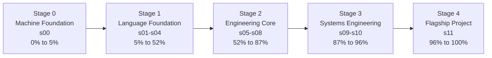

# The Go Engineer Progression

This document visualizes the stable v2.1 learner journey.

Section IDs and milestones must match [ARCHITECTURE.md](../ARCHITECTURE.md) and [curriculum.v2.json](../curriculum.v2.json).

## Learner Stage Progression

These learner stages are presentation milestones. The canonical section `phase` values in `curriculum.v2.json` remain `foundations`, `engineering-core`, and `systems`.

## Section Flow

```mermaid
flowchart LR
    S00["s00\nHow Computers Work"] --> S01["s01\nGetting Started"]
    S01 --> S02["s02\nLanguage Basics"]
    S02 --> S03["s03\nFunctions and Errors"]
    S03 --> S04["s04\nTypes and Design"]
    S04 --> S05["s05\nPackages, I/O and CLI"]
    S05 --> S06["s06\nBackend, APIs and Databases"]
    S06 --> S07["s07\nConcurrency"]
    S07 --> S08["s08\nQuality and Testing"]
    S08 --> S09["s09\nArchitecture and Security"]
    S09 --> S10["s10\nProduction Operations"]
    S10 --> S11["s11\nOpslane Flagship"]
```

## Engineering Context Growth

| Stage | Learner shift | Engineering weight |
| --- | --- | --- |
| Stage 0 | understand what the machine is doing | low, concrete |
| Stage 1 | read and write Go intentionally | growing |
| Stage 2 | build systems that behave predictably | high |
| Stage 3 | design, secure, and operate systems | very high |
| Stage 4 | integrate the curriculum into one backend system | full |

## Key Milestones

| Progress | Milestone | Surface | Proof |
| --- | --- | --- | --- |
| 5% | Machine model checkpoint | `HC.5` | explain process, memory, and execution basics |
| 10% | First program | `GT.2` | run and modify Hello World |
| 18% | Pricing Checkout | `CF.7` | reason through branches, loops, and cleanup |
| 24% | Contact Directory | `DS.6` | use slices, maps, and pointers together |
| 30% | Order Summary | `FE.7` | validate, orchestrate, and return errors cleanly |
| 44% | Payroll Processor | `TI.10` | model types, interfaces, and generics together |
| 58% | Filesystem Capstone | `FS.8` | build and test a filesystem-aware utility |
| 66% | REST API | `HS.10` | build a timeout-aware HTTP service |
| 70% | gRPC Service | `API.9` | define and serve a gRPC contract |
| 74% | Repository Pattern Project | `DB.6` | manage database access through clear boundaries |
| 77% | Concurrent Downloader | `GC.7` | coordinate goroutines and channels safely |
| 81% | URL Health Checker | `CP.5` | debug concurrent failure and cancellation paths |
| 85% | Benchmark Optimization | `PR.5` | profile and improve performance with evidence |
| 88% | Modular Refactor | `ARCH.9` | reorganize a service around stronger architecture |
| 91% | Secure API | `SEC.11` | apply practical security safeguards |
| 96% | Shutdown Capstone | `GS.3` | coordinate graceful drain and shutdown |
| 100% | Opslane Complete | `OPSL.10` | integrate the system end to end |

## Completion Standard

By completing the curriculum, a learner should be able to:

- explain how a computer executes code
- write Go code from scratch
- structure code for maintainability
- handle errors explicitly
- coordinate concurrent work safely
- test and profile code with evidence
- build HTTP, gRPC, and database-backed services
- secure, deploy, and operate production-shaped systems
- connect isolated Go techniques into one integrated backend

## Companion Surfaces

- [Known limitations](./KNOWN_LIMITATIONS.md)
- [Learner feedback loop](./LEARNER_FEEDBACK.md)
- [Glossary](./glossary.md)
- [Architecture decisions](./adr/README.md)
