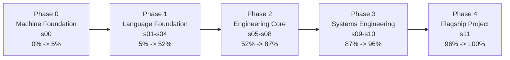

# The Go Engineer Visual Progression

> This document visualizes the learner journey through the v2.1 curriculum.
> Section IDs and milestones here must match [ARCHITECTURE.md](../ARCHITECTURE.md).

## Phase Progression

## Beginner to Senior Path

```mermaid
flowchart LR
    S00["s00\nHow Computers Work"] --> S01["s01\nGetting Started"]
    S01 --> S02["s02\nLanguage Basics"]
    S02 --> S03["s03\nFunctions & Errors"]
    S03 --> S04["s04\nTypes & Design"]
    S04 --> S05["s05\nPackages, I/O & CLI"]
    S05 --> S06["s06\nBackend, APIs & Databases"]
    S06 --> S07["s07\nConcurrency"]
    S07 --> S08["s08\nQuality & Testing"]
    S08 --> S09["s09\nArchitecture & Security"]
    S09 --> S10["s10\nProduction Operations"]
    S10 --> S11["s11\nOpslane Flagship"]
```

## Engineering Context Growth

| Phase | Learner Shift | Engineering Weight |
| --- | --- | --- |
| Phase 0 | "I understand what the machine is doing." | low but concrete |
| Phase 1 | "I can read and write Go intentionally." | growing |
| Phase 2 | "I can build systems that behave predictably." | high |
| Phase 3 | "I can design, secure, and operate systems." | very high |
| Phase 4 | "I can integrate everything into one production-shaped system." | full |

## Key Milestones

| Progress | Milestone | Surface | Proof |
| --- | --- | --- | --- |
| 5% | Machine model checkpoint | `HC.5` | explain process, memory, and execution basics |
| 10% | First program | `GT.2` | run and modify Hello World |
| 18% | Pricing Checkout | `CF.7` | reason through branches, loops, and cleanup |
| 24% | Contact Directory | `DS.6` | use slices, maps, and pointers together |
| 30% | Order Summary | `FE.7` | validate, orchestrate, and return errors cleanly |
| 44% | Payroll Processor | `TI.10` | model types, interfaces, and generics together |
| 58% | Log Search CLI | `FS.7` | build a practical I/O-heavy CLI tool |
| 66% | REST API | `HS.10` | build a timeout-aware HTTP service |
| 70% | gRPC Service | `API.9` | define and serve a gRPC contract |
| 74% | Repository Pattern Project | `DB.6` | manage database access through clear boundaries |
| 77% | Concurrent Downloader | `GC.7` | coordinate goroutines and channels safely |
| 81% | URL Health Checker | `CP.5` | debug concurrent failure and cancellation paths |
| 85% | Benchmark Optimization | `PR.5` | profile and improve performance with evidence |
| 88% | Modular Refactor | `ARCH.9` | reorganize a service around stronger architecture |
| 91% | Secure API | `SEC.11` | apply practical security safeguards |
| 96% | Shutdown Capstone | `GS.3` | coordinate graceful drain and shutdown |
| 100% | Opslane Complete | `s11` | integrate the whole system end to end |

## Promise

By completing this curriculum, the learner should be able to:

- explain how a computer executes code
- write Go code from scratch
- structure code for maintainability
- handle errors explicitly and predictably
- write concurrent code with safer coordination
- test and profile code with evidence
- build production HTTP, gRPC, and database-backed services
- secure, deploy, and operate systems
- think like an engineer instead of copying isolated patterns
