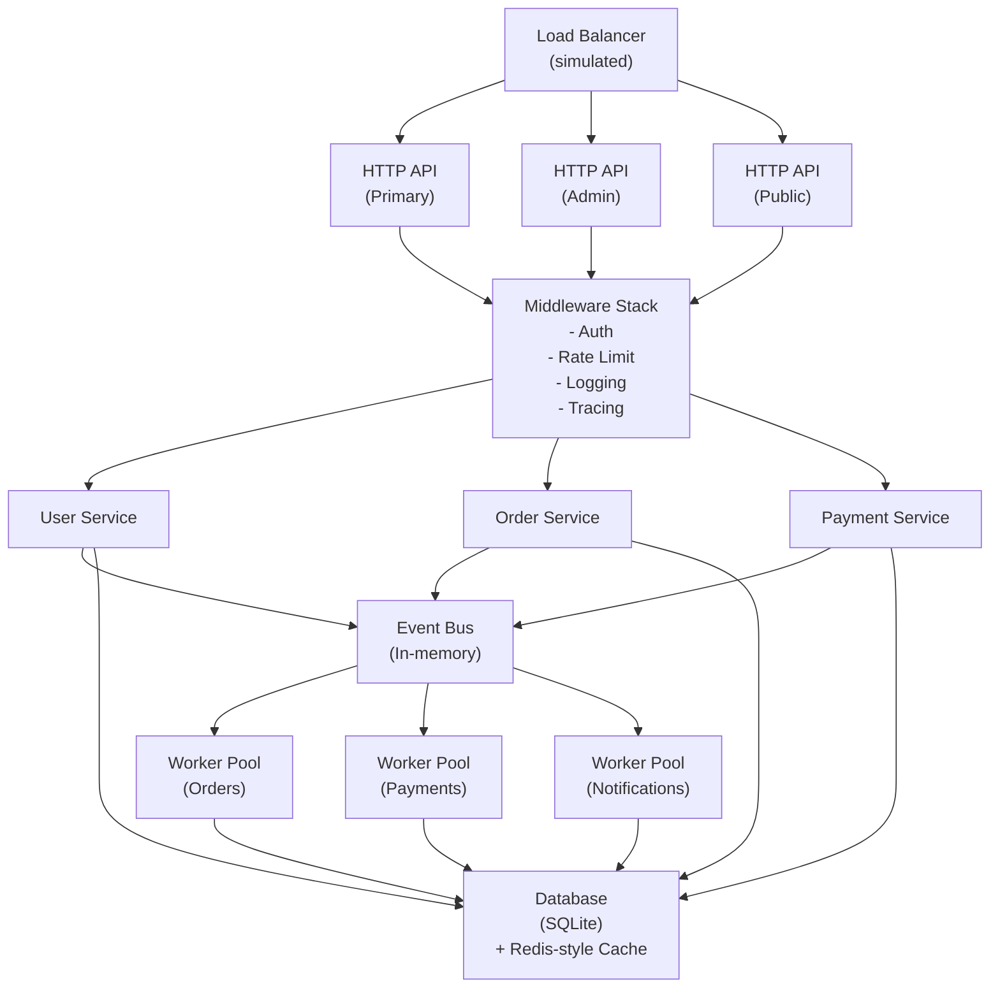

# Opslane SaaS Backend - Flagship Project Specification

## Vision

Opslane is the final integrated system in The Go Engineer.

It is a production-shaped multi-tenant SaaS backend where learners stop solving isolated lessons
and start making whole-system engineering decisions across HTTP, databases, concurrency, testing,
architecture, and operations.

This is not a tutorial capstone. It is an integration and judgment capstone.

---

## Product Framing

### Opslane - Multi-tenant SaaS Platform

Opslane simulates a real SaaS backend with:

- user authentication and authorization
- tenant isolation
- order processing
- payment workflow simulation
- event-driven background work
- bounded worker pools
- rate limiting
- structured logging and tracing
- observability and operational safeguards

The goal is not to mimic every production dependency.
The goal is to build a system that forces production-style thinking.

---

## Technical Architecture

### System Boundaries

- Keep this as a modular monolith first.
- Preserve boundaries that would let us split services later.
- Prefer explicit interfaces and clear ownership over premature service extraction.

---

## Implementation Modules

### Module 1: Foundation and Configuration

**Goal**: establish the runnable server shell and validated configuration model.

**Key surfaces**:

- `cmd/server/main.go`
- `internal/config/config.go`
- `internal/config/environment.go`
- `.env.example`

**Engineering focus**:

- environment-aware configuration
- startup validation
- explicit defaults vs overrides
- safe secret handling boundaries

**In production**:

- never commit real secrets
- validate config at startup, not after traffic arrives
- keep local, staging, and production settings separate

### Module 2: Database and Models

**Goal**: define the multi-tenant persistence layer and repository boundaries.

**Key surfaces**:

- `internal/models/user.go`
- `internal/models/tenant.go`
- `internal/models/order.go`
- `internal/models/payment.go`
- `internal/db/migrations.go`
- `internal/db/repository.go`

**Engineering focus**:

- multi-tenant schema design
- indexing
- connection pool discipline
- transaction handling
- repository contracts

**In production**:

- pool exhaustion becomes a whole-system outage
- use parameterized queries only
- multi-step state changes need transactions

### Module 3: Authentication and Tenant Isolation

**Goal**: add identity, authorization, and tenant-aware request flow.

**Key surfaces**:

- `internal/auth/jwt.go`
- `internal/auth/password.go`
- `internal/auth/middleware.go`
- `internal/models/user.go`

**Engineering focus**:

- JWT lifecycle
- password hashing
- role enforcement
- tenant scoping
- request context propagation

**In production**:

- rotate secrets
- record auth failures
- keep logout/token invalidation strategy explicit
- do not let tenant identity become optional middleware state

### Module 4: HTTP API Layer

**Goal**: build the public contract and middleware stack.

**Key surfaces**:

- `internal/handlers/user.go`
- `internal/handlers/order.go`
- `internal/handlers/payment.go`
- `internal/middleware/auth.go`
- `internal/middleware/ratelimit.go`
- `internal/middleware/logging.go`
- `internal/middleware/cors.go`

**Engineering focus**:

- read/write/idle timeouts
- request validation
- stable error responses
- per-tenant and per-user rate limits
- safe resource cleanup

**In production**:

- missing timeouts become resource leaks
- slow clients can trap connections
- every request should carry a traceable identifier

### Module 5: Order Processing

**Goal**: implement the core business workflow with explicit state transitions.

**Key surfaces**:

- `internal/services/order.go`
- `internal/services/inventory.go`
- `internal/services/validation.go`

**Engineering focus**:

- order state machine
- optimistic locking
- inventory coordination
- idempotency keys
- partial failure handling

**Failure drills**:

- what happens when 1,000 orders arrive together?
- what happens when inventory is reserved but payment fails?
- what happens when processing stops mid-transition?

### Module 6: Payment Pipeline

**Goal**: simulate external payment integration without hiding the reliability problems.

**Key surfaces**:

- `internal/services/payment.go`
- `internal/payment/gateway.go`
- `internal/payment/worker.go`

**Engineering focus**:

- retries with backoff
- timeouts
- duplicate protection
- reconciliation
- webhook-style state correction

**Failure drills**:

- gateway timeout
- duplicate payment attempt
- success without follow-up callback
- refund/chargeback race

### Module 7: Event Bus and Worker Pools

**Goal**: add bounded asynchronous work with observable lifecycle management.

**Key surfaces**:

- `internal/events/bus.go`
- `internal/events/types.go`
- `internal/workers/pool.go`
- `internal/workers/order_processor.go`
- `internal/workers/payment_processor.go`
- `internal/workers/notification_worker.go`

**Engineering focus**:

- bounded concurrency
- backpressure
- leak prevention
- drain behavior on shutdown
- dead letter strategy

**Critical questions**:

- what happens when the queue is full?
- what happens when no worker can accept new work?
- how do we inspect a stuck or silent worker safely?

### Module 8: Caching Layer

**Goal**: add cache-aware behavior without pretending cache invalidation is free.

**Key surfaces**:

- `internal/cache/cache.go`
- `internal/cache/store.go`
- `internal/middleware/cache.go`

**Engineering focus**:

- cache-aside pattern
- TTL handling
- invalidation discipline
- stampede prevention

### Module 9: Observability

**Goal**: make the system explain itself under load and failure.

**Key surfaces**:

- `internal/logging/logger.go`
- `internal/logging/middleware.go`
- `internal/metrics/metrics.go`
- `internal/tracing/tracing.go`

**Engineering focus**:

- structured logs
- log levels
- correlation IDs
- metrics
- trace propagation

**In production**:

- logs without identifiers are noise
- metrics without thresholds are decoration
- tracing should help answer why, not just show movement

### Module 10: Graceful Shutdown and Deployment

**Goal**: prepare the system to stop, recover, and deploy like a real service.

**Key surfaces**:

- `cmd/server/shutdown.go`
- `Dockerfile`
- `docker-compose.yml`
- `.github/workflows/ci.yml`

**Engineering focus**:

- signal handling
- draining in-flight work
- closing shared resources
- health/readiness behavior
- zero-downtime thinking

**Failure drills**:

- shutdown during order processing
- health check during drain
- shutdown with active workers and open DB connections

---

## Failure-Based Learning Scenarios

### Scenario 1: Traffic Spike

**Condition**: 10,000 requests per second for 30 seconds.

**Likely failures**:

- database pool exhaustion
- worker saturation
- memory pressure
- rate limiter overload

**Learner job**:

1. identify the first component to fail
2. add limits and backpressure
3. explain the tradeoff of those limits

### Scenario 2: Memory Leak

**Condition**: sustained traffic for one hour.

**Likely failures**:

- goroutine accumulation
- unclosed resources
- unbounded queues or slices

**Learner job**:

1. identify the leak source
2. fix the root cause
3. add enough instrumentation to catch it earlier next time

### Scenario 3: Race Condition

**Condition**: overlapping orders target the same inventory.

**Likely failures**:

- double allocation
- negative stock
- inconsistent order state

**Learner job**:

1. prove the race exists
2. add the right locking or transaction boundary
3. explain why that fix is safer than simpler alternatives

### Scenario 4: Cascading Failure

**Condition**: payment provider is down.

**Likely failures**:

- long retries
- blocked workers
- rising timeouts
- growing queue depth

**Learner job**:

1. bound the blast radius
2. add retry discipline
3. define fallback or compensation behavior

---

## Engineering Thinking Prompts

### Architecture

- Why keep this as a modular monolith first?
- Which boundaries would be hardest to split later?
- Where should tenant isolation be enforced first: middleware, service, or repository?

### Concurrency

- When is a worker pool better than spawning goroutines directly?
- What signal tells you to reject work rather than queue more?
- Where does backpressure belong in this system?

### Reliability

- When do we retry?
- When do we fail fast?
- When is compensation safer than a transaction?

### Operations

- Which metrics would tell you the system is degrading before users complain?
- What is the minimum log context needed to debug one failed order?
- What does a safe shutdown promise actually guarantee?

---

## Assessment Model

### Phase 1: Code Quality

- correctness
- explicit error handling
- system boundaries
- naming and maintainability

### Phase 2: Failure Injection

- diagnose injected failures
- explain the real root cause
- implement bounded fixes

### Phase 3: Performance and Scale

- identify bottlenecks
- support claims with measurements
- improve behavior without introducing hidden instability

### Phase 4: Architecture Defense

- explain design choices
- compare alternatives
- justify tradeoffs clearly

---

## Success Criteria

A learner who completes Opslane should be able to:

1. build a production-shaped HTTP backend
2. model multi-tenant boundaries intentionally
3. implement explicit reliability behavior under failure
4. write bounded concurrent workers
5. reason about backpressure and queue pressure
6. instrument the system with logs, metrics, and traces
7. handle graceful shutdown and in-flight work
8. diagnose bottlenecks with evidence
9. defend architectural tradeoffs
10. extend a larger integrated codebase without losing system clarity

---

## Recommended Build Order

| Week | Modules | Focus |
| --- | --- | --- |
| 1 | 1-2 | server shell, config, database, models |
| 2 | 3-4 | authentication, tenant flow, API surfaces |
| 3 | 5-6 | order workflow and payment simulation |
| 4 | 7-8 | async processing and caching |
| 5 | 9-10 | observability, shutdown, deployment |

---

Opslane is the flagship because it forces the learner to integrate everything the curriculum taught
and to answer the harder question: not only "does it run?" but also "how does it behave under
pressure, failure, and change?"
